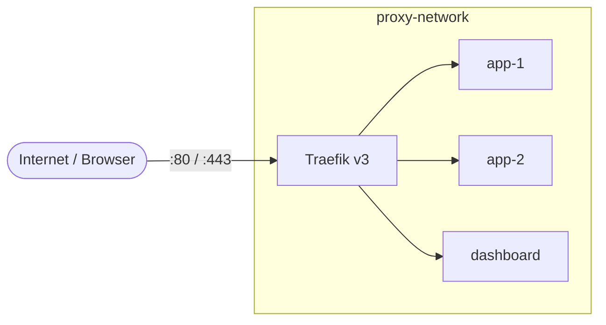

# Traefik v3 — Reverse Proxy (Produção + Desenvolvimento)

👉 [Artigo completo sobre o assunto.](https://fabriciopa.com.br/artigos/traefik-v3-docker-producao)

Um setup de [Traefik v3](https://traefik.io/) com Docker Compose que serve como **porta de entrada única** para seus containers. Você sobe o Traefik **uma vez** e, a partir daí, qualquer outro projeto é exposto apenas adicionando _labels_ — sem mexer em portas, nginx ou certificados manualmente.

O repositório traz dois ambientes prontos:

- 🚀 **`development/`** — local, HTTP + HTTPS (certificado confiável via `mkcert`), sem senha, logs em modo debug.
- 🔒 **`production/`** — VPS com domínio, TLS automático (Let's Encrypt), redirecionamento HTTP→HTTPS e dashboard protegido.



Todos os serviços conversam pela mesma rede Docker (`proxy-network`). Basta o container ter o label `traefik.enable=true` e estar nessa rede para o Traefik descobri-lo automaticamente.

---

## Visão geral — Dev vs Produção

| | 🚀 Development | 🔒 Production |
|---|---|---|
| **Quando usar** | Desenvolvimento local | VPS / servidor público |
| **Protocolo** | HTTP (`:80`) e HTTPS (`:443`) | HTTPS (`:443`), com redirect de `:80` |
| **TLS / Certificado** | Local, confiável, via `mkcert` | Let's Encrypt automático |
| **Autenticação** | Nenhuma | Basic Auth no dashboard |
| **Dashboard** | `localhost:8080` (aberto) | Domínio próprio, atrás de auth |
| **Domínio** | `*.localhost` (sem config) | Domínio real apontando pra VPS |
| **Logs** | DEBUG (texto) | Padrão |

---

## Estrutura do repositório

```
traefik/
├── traefik.sh          # script raiz — gerencia os dois ambientes
├── production/         # VPS: TLS, HTTPS, Basic Auth, security headers
│   ├── docker-compose.yml
│   ├── .env.example
│   ├── setup-traefik-prod.sh
│   └── backup-acme.sh  # backup dos certificados (agendar no cron)
└── development/        # local: HTTP+HTTPS, sem auth, logs de debug
    ├── docker-compose.yml
    ├── .env.example
    ├── setup-traefik-dev.sh
    └── traefik/
        ├── certs/            # certificado mkcert (git-ignored, gerado no setup)
        ├── dynamic/          # config dinâmica apontando pro certificado
        └── dev-domains.txt   # domínios .dev extras cobertos pelo certificado
```

---

## O script `traefik.sh`

Atalho para rodar `docker compose` no ambiente certo, de qualquer lugar do repositório:

```bash
./traefik.sh <dev|prod> [comando do docker compose]
```

| Comando | O que faz |
|---|---|
| `./traefik.sh dev` | `docker compose up -d` em `development/` |
| `./traefik.sh prod` | `docker compose up -d` em `production/` |
| `./traefik.sh dev logs -f` | Acompanha os logs em dev |
| `./traefik.sh prod restart` | Reinicia a produção |
| `./traefik.sh prod down` | Para a produção |

---

## 🚀 Desenvolvimento

Feito para uso local — **sem domínio real, sem senha**, mas com HTTPS de verdade via certificado local (`mkcert`). Comece por aqui.

### Quick start

```bash
# 1. Setup único (cria a rede proxy-network e o certificado TLS local — pode pedir sua senha do sudo)
bash development/setup-traefik-dev.sh

# 2. Sobe o Traefik
./traefik.sh dev
```

Dashboard disponível em **`http://localhost:8080/dashboard/`** — funciona de imediato, sem nenhuma configuração. Via `traefik.local` (veja abaixo), também dá pra acessar em `https://traefik.local/dashboard/`.

### Expondo um serviço

No `docker-compose.yml` do seu projeto, adicione os _labels_ e conecte-o à `proxy-network`:

```yaml
services:
  my-app:
    image: my-app:latest
    labels:
      - "traefik.enable=true"
      - "traefik.http.routers.my-app.rule=Host(`myapp.localhost`)"
      - "traefik.http.routers.my-app.entrypoints=web"
    networks:
      - proxy-network

networks:
  proxy-network:
    external: true
```

Pronto — acesse `http://myapp.localhost`. Domínios `.localhost` resolvem para `127.0.0.1` nativamente na maioria dos navegadores e sistemas, sem precisar editar `/etc/hosts` (mas é recomendado fazer essa configuração em `/etc/hosts`).

### Habilitando HTTPS no serviço

O Traefik de dev carrega um certificado gerado pelo `mkcert` (via `setup-traefik-dev.sh`) que cobre `*.localhost`, `*.local`, `traefik.local`, `localhost`, `127.0.0.1` e qualquer domínio `.dev` listado em `development/traefik/dev-domains.txt` — como é confiável pelo navegador/SO da sua máquina, **não há avisos de certificado inválido**. Para o serviço aceitar HTTPS, basta adicionar um segundo router apontando pro entrypoint `websecure` com `tls=true` — **sem certresolver**, o certificado é resolvido automaticamente por SNI:

```yaml
labels:
  - "traefik.enable=true"
  # router HTTP (como já existia)
  - "traefik.http.routers.my-app.rule=Host(`myapp.localhost`)"
  - "traefik.http.routers.my-app.entrypoints=web"
  # router HTTPS — mesmo host, outro entrypoint
  - "traefik.http.routers.my-app-secure.rule=Host(`myapp.localhost`)"
  - "traefik.http.routers.my-app-secure.entrypoints=websecure"
  - "traefik.http.routers.my-app-secure.tls=true"
```

Pronto — acesse `https://myapp.localhost` sem warnings. Se `development/traefik/certs/` estiver vazio (setup nunca rodado), o `websecure` cai no certificado padrão (não confiável) do próprio Traefik — o HTTP em `:80` continua funcionando normalmente.

> Usando `myapp.local` em vez de `.localhost`? O certificado cobre esse wildcard também, mas ele **não resolve sozinho para `127.0.0.1`** — adicione a entrada no `/etc/hosts` (`.local` também pode conflitar com mDNS/Bonjour em alguns sistemas).

<details>
<summary><b>Usando domínio <code>.dev</code> (ex.: <code>myapp.dev</code>)?</b></summary>

`.dev` **não pode usar wildcard**. Diferente de `.localhost`/`.local`, `.dev` é um TLD público de verdade (administrado pelo Google) e está na *Public Suffix List* — o Chrome recusa qualquer certificado wildcard emitido direto sobre um TLD público, mesmo com CA confiável localmente (`*.dev` poderia, em teoria, autenticar o domínio `.dev` de qualquer pessoa). O erro típico é `net::ERR_CERT_COMMON_NAME_INVALID` — e `curl`/`openssl` **não reproduzem** esse erro, porque só o navegador aplica essa regra.

A solução é listar cada domínio `.dev` explicitamente:

1. Adicione o domínio (uma linha, sem wildcard) em `development/traefik/dev-domains.txt`:
   ```
   myapp.dev
   ```
2. Rode `bash development/setup-traefik-dev.sh` de novo pra regerar o certificado
3. Garanta a entrada no `/etc/hosts` (domínios `.dev` também não resolvem sozinhos pra `127.0.0.1`):
   ```bash
   echo "127.0.0.1 myapp.dev" | sudo tee -a /etc/hosts
   ```

De quebra: `.dev` é HSTS-preloaded no navegador inteiro — HTTP puro simplesmente não funciona nesse TLD, então o router `websecure`/`tls=true` já é obrigatório ali (não é opcional como em `.localhost`).
</details>

<details>
<summary><b>Meu container não escuta na porta 80</b></summary>

Se o serviço escuta em outra porta (ex.: `3000`), informe ao Traefik com o label `loadbalancer.server.port`:

```yaml
labels:
  - "traefik.enable=true"
  - "traefik.http.routers.my-app.rule=Host(`myapp.localhost`)"
  - "traefik.http.routers.my-app.entrypoints=web"
  # container escuta na 3000 em vez da 80
  - "traefik.http.services.my-app.loadbalancer.server.port=3000"
```

A porta é a **interna do container** — ela **não** precisa ser publicada com `ports:` no compose.
</details>

<details>
<summary><b>Acessar o dashboard via <code>traefik.local</code></b></summary>

Como alternativa ao `localhost:8080`, adicione uma entrada no `/etc/hosts`:

```bash
echo "127.0.0.1 traefik.local" | sudo tee -a /etc/hosts
```

Depois acesse `http://traefik.local/dashboard/` ou `https://traefik.local/dashboard/` (certificado confiável via `mkcert`, sem avisos).
</details>

---

## 🔒 Produção

Para uma VPS Linux com domínio público. Cuida do TLS automático (Let's Encrypt), do redirecionamento HTTP→HTTPS e de um dashboard protegido por Basic Auth.

### Pré-requisitos

- Docker e Docker Compose v2
- Um domínio (ou subdomínio) apontando para o IP público do servidor
- Portas `80` e `443` liberadas no firewall
- `apache2-utils` (para o `htpasswd`) — o script de setup instala se faltar

### Quick start

```bash
# 1. Setup único (cria diretórios, acme.json, rede e credenciais)
bash production/setup-traefik-prod.sh

# 2. Edita as variáveis de ambiente
nano production/.env

# 3. Sobe o Traefik
./traefik.sh prod
```

### Variáveis de ambiente (`production/.env`)

| Variável | Descrição | Exemplo |
|---|---|---|
| `ACME_EMAIL` | E-mail para avisos do Let's Encrypt | `admin@example.com` |
| `TRAEFIK_DASHBOARD_HOST` | Domínio do dashboard do Traefik | `traefik.example.com` |
| `ACME_CASERVER` | (Opcional) CA do ACME — sem definir, usa a CA de produção do Let's Encrypt | CA de staging, para testes |

Copie `production/.env.example` para `production/.env` e preencha. O `.env` é ignorado pelo git e **nunca** deve ser commitado.

> O `./traefik.sh prod` se recusa a subir se o `.env` estiver ausente, vazio ou com os valores de exemplo — assim o erro aparece na hora, e não minutos depois na emissão do certificado.

### Expondo um serviço

```yaml
services:
  my-app:
    image: my-app:latest
    labels:
      - "traefik.enable=true"
      - "traefik.http.routers.my-app.rule=Host(`app.example.com`)"
      - "traefik.http.routers.my-app.entrypoints=websecure"
      - "traefik.http.routers.my-app.tls.certresolver=letsencrypt"
    networks:
      - proxy-network

networks:
  proxy-network:
    external: true
```

<details>
<summary><b>Security headers no meu serviço</b></summary>

Os middlewares `dashboard-*` (auth, headers, rate limit) pertencem **apenas ao dashboard** — não os reutilize: middlewares definidos via labels do Docker são resolvidos por nome global, e compartilhar o mesmo nome entre projetos causa conflito.

Para aplicar security headers no seu serviço, defina um middleware **com nome próprio** nos labels dele, copiando as diretivas de `production/docker-compose.yml`:

```yaml
labels:
  - "traefik.http.routers.my-app.middlewares=my-app-security-headers@docker"
  - "traefik.http.middlewares.my-app-security-headers.headers.stsSeconds=31536000"
  - "traefik.http.middlewares.my-app-security-headers.headers.stsIncludeSubdomains=true"
  - "traefik.http.middlewares.my-app-security-headers.headers.contentTypeNosniff=true"
  - "traefik.http.middlewares.my-app-security-headers.headers.frameDeny=true"
  - "traefik.http.middlewares.my-app-security-headers.headers.referrerPolicy=strict-origin-when-cross-origin"
```
</details>

<details>
<summary><b>Testar TLS sem estourar o rate limit (staging)</b></summary>

O Let's Encrypt tem um [limite](https://letsencrypt.org/docs/rate-limits/) de 5 certificados duplicados por semana. Use a CA de staging durante os testes:

1. Descomente `ACME_CASERVER` no `production/.env` (sem a variável, o default é **sempre** a CA de produção — não há como esquecer configuração de teste no compose):
   ```bash
   ACME_CASERVER=https://acme-staging-v02.api.letsencrypt.org/directory
   ```
2. Esvazie `production/traefik/acme/acme.json` e reinicie
3. Verifique que o certificado foi emitido (será não confiável — esperado em staging)
4. Comente a variável de novo, esvazie o `acme.json` outra vez e reinicie para obter o certificado real
</details>

<details>
<summary><b>Backup dos certificados (acme.json)</b></summary>

O `acme.json` guarda os certificados **e as chaves privadas** emitidos pelo Let's Encrypt. Perdê-lo força a reemissão de tudo — e pode esbarrar no rate limit (5 certificados duplicados por semana).

**Como funciona:** `production/backup-acme.sh` copia o `acme.json` para `acme.json.<dia-da-semana>` (1 = segunda … 7 = domingo), mantendo **7 cópias rotativas** — cada dia sobrescreve a cópia da semana anterior. As cópias preservam o modo `600` e o destino (`production/backups/` por padrão) é ignorado pelo git.

**Rodar manualmente** (ex.: antes de mexer na config de TLS):

```bash
bash production/backup-acme.sh                # → production/backups/
bash production/backup-acme.sh /outro/destino # destino customizado
```

**Agendar no cron do servidor** (o jeito recomendado — configure uma vez e esqueça):

```bash
crontab -e

# todo dia às 3h da manhã
0 3 * * * /bin/bash /caminho/para/production/backup-acme.sh
```

**Verificar se está rodando:**

```bash
ls -la production/backups/
# deve listar acme.json.1 … acme.json.7 com datas recentes e modo -rw-------
```

**Restaurar um backup** (acme.json corrompido/perdido):

```bash
./traefik.sh prod down
cp production/backups/acme.json.<dia> production/traefik/acme/acme.json
chmod 600 production/traefik/acme/acme.json
./traefik.sh prod
```

> ⚠️ As cópias ficam **no mesmo disco** do servidor — protegem contra deleção acidental e corrupção, não contra perda da VPS. Para cobrir esse caso, sincronize `production/backups/` para fora da máquina (rsync, restic, object storage). Trate as cópias como segredo: contêm as chaves privadas dos certificados.
</details>

<details>
<summary><b>Operações comuns e health check</b></summary>

```bash
./traefik.sh prod logs -f traefik
./traefik.sh prod restart
./traefik.sh prod down

# Health check (produção)
curl -s http://127.0.0.1:8082/ping
```
</details>

---

## ❓ Troubleshooting

<details>
<summary><b>Certificado não é emitido (produção)</b></summary>

- Confirme que o registro DNS A do domínio aponta para o IP deste servidor
- Garanta que a porta 80 está acessível pela internet (o desafio HTTP exige isso)
- Veja os logs: `./traefik.sh prod logs -f traefik | grep -i acme`
</details>

<details>
<summary><b>Dashboard não carrega (produção)</b></summary>

- Verifique se `TRAEFIK_DASHBOARD_HOST` no `production/.env` bate com o domínio acessado
- Confirme o DNS: `dig +short seu-dominio.com`
</details>

<details>
<summary><b>Serviço não é detectado pelo Traefik</b></summary>

- Confirme que o serviço está conectado à `proxy-network`
- Verifique se o label `traefik.enable=true` está presente
- Veja os logs: `./traefik.sh dev logs traefik`
</details>

<details>
<summary><b>HTTPS em dev mostra aviso de certificado inválido</b></summary>

- Rode `bash development/setup-traefik-dev.sh` — ele instala o `mkcert`, registra a CA local nos navegadores/SO (`mkcert -install`) e gera o certificado
- **Domínio `.dev`?** É esperado dar `net::ERR_CERT_COMMON_NAME_INVALID` até você listar o domínio explicitamente em `development/traefik/dev-domains.txt` e rodar o setup de novo — veja "Usando domínio `.dev`" na seção de Desenvolvimento acima. `curl`/`openssl` não reproduzem esse erro, só o navegador
- Confirme que o certificado cobre o host acessado: `openssl s_client -connect 127.0.0.1:443 -servername myapp.localhost </dev/null 2>/dev/null | openssl x509 -noout -ext subjectAltName`
- Veja se há erro de TLS nos logs: `./traefik.sh dev logs traefik | grep -i tls`
</details>

<details>
<summary><b>Erro de permissão no acme.json (produção)</b></summary>

O arquivo precisa estar com modo `600`:

```bash
chmod 600 production/traefik/acme/acme.json
```
</details>

---

## 🛡️ Notas de segurança (produção)

<details>
<summary><b>Expandir</b></summary>

- O Traefik **não acessa o socket do Docker diretamente**: um sidecar `socket-proxy` (tecnativa/docker-socket-proxy) numa rede interna libera apenas os endpoints read-only necessários (listar containers, eventos, versão) e nega qualquer escrita (`POST=0`). Uma eventual RCE no Traefik não vira acesso root ao host via API do Docker.
- `no-new-privileges: true` está definido em todos os containers (inclusive em dev)
- O dashboard não é acessível por HTTP puro nem exposto na porta 8080
- As credenciais do dashboard usam bcrypt (fator de custo 12) via `htpasswd -B`, arquivo com modo `600`
- A porta interna de ping (8082) não fica vinculada a nenhuma interface pública
- Logs com rotação (`max-size: 10m`, `max-file: 5`) — o access log não enche o disco da VPS
- Em **desenvolvimento**, as portas 80/443/8080 ficam vinculadas a `127.0.0.1` — o dashboard sem autenticação não fica visível para outras máquinas da rede local. O certificado HTTPS de dev (`mkcert`) é só local: a CA fica confiável apenas nesta máquina, não expõe nada à rede
</details>

---

## Licença

MIT
